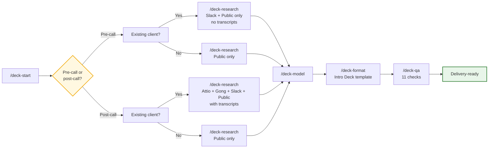

# Opportunity Analysis

The Jolly Opportunity Analysis plugin for Claude. Give it a company name and it handles the research, builds the financial model, and formats the presentation — start to finish.

> **Internal tool.** Maintained by the Incentineering team. Requires access to the private `Jolly-Incentineering/opportunity-analysis` repo and the Jolly shared workspace.

**Intro Deck workflow** — a streamlined template that works for both pre-call and post-call contexts. Claude captures whether it's pre-call or post-call to inform the research phase, but uses the same workflow and template throughout (~10–15 min). **Two ways to run it:** automatically with `/deck-auto [Company]`, or step-by-step yourself. Both are covered below.

**Latest features (v3.0.0):**
- **Two commands:** `/deck-auto [Company]` starts a new deck, `/deck-continue` resumes from where you left off. Individual phase commands still work but are hidden under "Advanced".
- **`deck_engine.py`:** Standalone CLI replacing all inline Python in skills — 7 actions (fill-banners, format-dollars, find-placeholders, set-title, set-pdf-title, finalize, copy-vf). Skills are now thin orchestrators.
- **Portable scripts:** `jolly_utils.py`, `qa_check.py`, `excel_editor.py`, and `template_scanner.py` all resolve paths from `JOLLY_WORKSPACE` env var + workspace config. No hardcoded developer paths.
- **CLI interfaces on all scripts:** `excel_editor.py` (scan-formulas, write-cells, read-summary), `template_scanner.py` (scan, match, create configs) — skills call them via argparse, not class imports.

**[→ See full v3.0.0 release notes](https://github.com/Jolly-Incentineering/opportunity-analysis/releases/tag/v3.0.0)**

---

## Workflow at a glance

```
┌─────────────────────────────────────────────────────────────────────────────────────┐
│                      JOLLY OPPORTUNITY ANALYSIS PIPELINE                            │
├────────────────┬───────────────────────────────────────────┬────────────────────────┤
│   Command      │  What it does                             │  Output                │
├────────────────┼───────────────────────────────────────────┼────────────────────────┤
│ /deck-auto     │  Runs the whole workflow automatically,   │  Completed Opportunity │
│  [Company]     │  pausing only when it needs your input.   │  Analysis package      │
│                │  Saves progress so you can stop and       │  ready to send         │
│                │  resume any time.                         │                        │
├────────────────┼───────────────────────────────────────────┼────────────────────────┤
│ /deck-setup    │  First-time setup. Finds your Jolly       │  Saved workspace       │
│   (once)       │  folder and saves its location so all     │  config file           │
│                │  other commands know where to look.       │                        │
├────────────────┼───────────────────────────────────────────┼────────────────────────┤
│ /deck-start    │  Creates the client folder, copies the    │  Templates in place,   │
│  [Company]     │  right template files, opens them,        │  branch detected       │
│                │  detects whether this is an existing      │  (existing client or   │
│                │  client or new prospect, and starts       │  new prospect),        │
│                │  downloading logos and brand assets       │  assets downloading    │
│                │  in the background.                       │  in background         │
├────────────────┼───────────────────────────────────────────┼────────────────────────┤
│ /deck-research │  Pulls everything Claude can find about   │  Research summary,     │
│                │  the company — CRM records, emails,       │  campaign list for     │
│                │  Slack messages, public data. Proposes    │  your approval         │
│                │  a campaign list for your approval.       │                        │
├────────────────┼───────────────────────────────────────────┼────────────────────────┤
│ /deck-model    │  Fills in the Excel model with the        │  Populated Excel model │
│                │  research data. Shows you the full plan   │  with source notes     │
│                │  first — you approve before it writes     │  on every cell         │
│                │  anything.                                │                        │
├────────────────┼───────────────────────────────────────────┼────────────────────────┤
│ /deck-format   │  Pulls in brand assets, fills in the      │  Formatted PowerPoint, │
│                │  presentation with the right numbers,     │  exported PDF          │
│                │  walks you through manual brand steps,    │                        │
│                │  exports PDF.                             │                        │
├────────────────┼───────────────────────────────────────────┼────────────────────────┤
│ /deck-qa       │  Runs a full quality check across the     │  QA report,            │
│                │  model and presentation before delivery.  │  delivery-ready files  │
│                │  Flags anything that needs fixing.        │                        │
└────────────────┴───────────────────────────────────────────┴────────────────────────┘

**Total time:** Pre-call (Slack + Public only): ~8–12 min. Post-call (with Attio/Gong transcripts): ~14–20 min.
```

---

## Two ways to work

### Automatic mode — `/deck-auto [Company]`

This is the recommended way to run the workflow. Type `/deck-auto Firebirds` (or whatever company name), and Claude takes it from there.

Claude will run every phase in order — research, model, formatting, QA. Along the way it will pause and ask you questions, like which template to use or whether the campaign list looks right. There are also three steps only you can do (like manually refreshing a link in PowerPoint) — Claude will stop, give you clear instructions, wait for you to finish, and then continue.

When it stops, it saves your progress automatically. Think of this like a bookmark — if you need to close your laptop and come back later, just run `/deck-auto [Company]` again and it picks up exactly where it left off. You do not lose any work.

### Step-by-step mode

Run each command yourself in order: `/deck-start`, then `/deck-research`, then `/deck-model`, then `/deck-format`, then `/deck-qa`. This gives you more control and lets you review each phase before moving to the next. The rest of this guide covers each command in detail.

---

## How the workflow flows



The diagram shows how an Opportunity Analysis moves from setup through research, modeling, formatting, and QA. While all decks use the same "Intro Deck" template, **research adapts based on context**: Pre-call uses Slack + Public data (no transcripts), while post-call includes full Attio/Gong research with call transcripts. Branch detection (existing client vs. new prospect) further refines the research scope. The orange diamond is a gate where the workflow pauses and waits for your input. QA uses 11 streamlined checks. `/deck-auto` is a wrapper that drives through the entire flow for you, so you only have to respond at the gate points rather than kick off each step manually.

---

## Model selection strategy

- **Research agents (Haiku):** All research workstreams (Attio/Gong, Slack, public data) run via Haiku agents for speed. If an agent detects a complex scenario it cannot handle reliably, it will tell you and recommend a manual Sonnet review.

- **Excel population (Haiku by default, Sonnet for complex):** Model population uses Haiku for standard tasks (straightforward cell mapping, campaign entry). For unusually complex models, intricate row/column logic, or ambiguous campaign validation, the workflow will pause and handle it with Sonnet to ensure accuracy.

---

## Install

Open Claude Code (the chat interface you use for Claude) and type:

```
/plugin install opportunity-analysis@Jolly-Incentineering --scope user
```

You need access to the private Jolly GitHub repo for this to work. If you get an error, ask Incentineering.

---

## First-time setup

You only need to do this once, on each computer you use.

**Recommended: Use the interactive onboarding guide.** When you first install the plugin, run:

```
/jolly-onboarding
```

This walks you through everything step-by-step in plain language — no technical knowledge needed. It guides you through connecting Slack and Attio, setting your workspace path, and running the one-time setup. Takes about 10 minutes total.

### Or set up manually:

**Step 1 — Tell Claude where your Jolly folder is**

Claude needs to know where the Jolly shared folder lives on your computer. This is called your "workspace path" — set it as a System environment variable (on Windows) or export it in your shell (on Mac).

Windows:
- Press Windows key, type "environment variables"
- Click "Edit the system environment variables"
- Click "Environment Variables..." (button at bottom)
- Under "System variables", click "New..."
- Variable name: `JOLLY_WORKSPACE`
- Variable value: `C:\Users\YourName\OneDrive - Default Directory\Jolly - Documents`
- Click OK on all windows and **restart Claude Code**

Mac:
- Open Terminal
- Run: `echo 'export JOLLY_WORKSPACE="/Users/YourName/Jolly - Documents"' >> ~/.zshrc`
- Close Terminal and **restart Claude Code**

**Step 2 — Run setup**

Once the folder path is configured, type this in Claude:

```
/deck-setup
```

Claude will find your client folder, confirm the location, save configuration for Gong (if you use it), and save it so all future commands know where to look. This takes a few seconds and you only do it once. If you run it again later, it will just confirm everything is already set up and stop.

---

## Commands reference

### `/deck-setup`

**What it does:** Finds your Jolly client folder and saves its location. All other commands depend on this running first.

**What you do:** Nothing — just run it.

**What Claude does:** Scans your workspace for the client folder. If it finds more than one possible match, it will ask you to confirm which one to use.

**Output:** A saved config file that all other commands read from automatically.

**Run this:** Once, on first install.

---

### `/deck-start [Company Name]`

**What it does:** Gets everything ready to start a new Opportunity Analysis. Creates the folder structure, copies the right template files, opens them on your screen, and starts downloading logos and brand assets in the background while you move on.

**What you do:** Provide the company name. Claude will ask you two questions before starting: whether it's pre-call or post-call (to determine research scope), and which template to use.

**What Claude does:**
- Checks whether you already have an active session for this company (and stops if you do, to avoid duplicates)
- Asks whether this is pre-call or post-call — this determines which research sources to use (post-call includes call transcripts; pre-call uses public data only)
- Lists available Intro Deck templates grouped by industry — you pick the number
- Copies the Excel model and PowerPoint presentation to the right client folder with dated naming (YYYY.MM.DD)
- Creates the numbered subfolder structure (1. Logos/, 2. Swag/, 1. Call Summaries/, 2. Public Filings/, 3. Slack/)
- Opens both files on your screen
- Figures out whether this is an existing client (has prior calls, emails, or CRM records) or a brand-new prospect — this affects how research runs later
- Starts downloading logos and swag images in the background

**Output:** Templates in the client folder, assets downloading in the background.

**Example:**
```
/deck-start Firebirds
```

---

### `/deck-research`

**What it does:** Pulls together information about the company based on context and branch, proposes a campaign list, and asks you to confirm before moving on.

**What you do:** Review the proposed campaign list and type "confirm" to proceed. If anything looks off — a campaign is missing, or one shouldn't be included — say so before confirming.

**What Claude does:** Research scope depends on context:

**Pre-call path (faster):**
- **Slack research** — searches Slack for messages about the company (existing clients only)
- **Public research** — looks up SEC filings, industry benchmarks, LinkedIn headcount, etc.
- No Attio/Gong lookup (no call transcripts needed)

**Post-call path (comprehensive):**
- **CRM and call research** — checks Attio for records, notes, emails; pulls transcripts from past calls if existing client (Gong data if connected)
- **Slack research** — searches Slack for messages about the company (existing clients only)
- **Public research** — looks up SEC filings, industry benchmarks, LinkedIn headcount, etc.

All applicable tasks run in parallel and report back with their findings. Claude combines everything, flags any conflicts between sources, and presents a clean summary. If any required information is missing, it will tell you before asking for campaign confirmation.

**Output:** A research summary file saved to your workspace, and a confirmed campaign list that flows into the next step.

**Gate:** Claude will pause and ask you to confirm the campaign list before continuing.

---

### `/deck-model`

**What it does:** Fills in the Excel financial model using the research data. Before writing anything, it shows you the full plan — every value it intends to enter, with the source — and waits for your approval.

**What you do:** Review the plan Claude presents. If everything looks right, type "approve." If something needs to change, tell Claude what to adjust before approving.

**What Claude does:**
- Maps every value to the right cell in the model by looking up row labels (not fixed positions, so it works across all template versions)
- Rounds every number to Jolly's standards (e.g., revenue to the nearest $500K, employees to the nearest 50)
- Checks that every campaign's return-on-spend falls in the 10x–30x target range
- Checks that total EBITDA impact stays within the 15% ceiling
- After approval, writes every value and adds a source note to each hard-coded cell explaining where the number came from
- Verifies no formula cells were accidentally overwritten

**Output:** A fully populated Excel model with source notes on every assumption cell.

**Gate:** Claude will pause and show you the full plan before writing anything. You must type "approve" to continue.

---

### `/deck-format`

**What it does:** Takes the branded assets and model outputs and puts them into the PowerPoint presentation. Scans every slide for placeholder text and replaces with correct values and narrative. Walks you through any manual steps one at a time. Exports the final PDF when done.

**What you do:** There are a few manual steps only you can do in PowerPoint (like refreshing a data link). Claude will stop at each one, give you clear step-by-step instructions, and wait for you to type "done" before moving on.

**What Claude does:**
- Scans every slide for placeholder text (like `[Company Name]` or `[Revenue]`) and replaces with correct values and narrative. Formats all dollar amounts correctly — under $1M shows as `$516k`, $1M and above shows as `$1.9MM`.
- Presents the replacement plan and waits for your approval before writing
- Walks through placing logos, swag images, and banner graphics
- Exports the final PDF to the Presentations folder and opens it for your review

**Output:** A formatted PowerPoint file and an exported PDF in the `2. Presentations` folder.

**Gates:** Claude will pause for approval before replacing banner values, before replacing text values, and at each manual step.

---

### `/deck-qa`

**What it does:** Runs a full quality check on the model and presentation before you send anything. Catches formatting issues, missing data, out-of-range numbers, and anything else that would be embarrassing to send to a client.

**What you do:** Review any flagged issues and fix them. Claude walks through each one interactively and re-runs the check after you confirm it is fixed.

**What Claude does:** Runs 11 focused checks:

| Check | What it looks for |
|-------|-------------------|
| M1 | Correct number of formula cells in the model (confirms nothing was accidentally deleted or overwritten) |
| M2 | No required assumption cells left blank |
| M3 | Every active campaign's return-on-spend is in the 10x–30x range |
| M4 | Total EBITDA impact is within the 15% ceiling |
| M5 | Hiring cost is not above $3,500 (QSR models) |
| M6 | Source notes present on all hard-coded cells |
| D2 | All dollar amounts formatted correctly |
| D3 | Banner numbers on the presentation match the model output |
| D4 | Campaign slides match the approved campaign list |
| D5 | Logo and brand assets are placed |
| D7 | The exported PDF matches the current state of the presentation |

After all checks pass, Claude cleans up any temporary lock files and gives you the final list of delivery-ready files.

**Gate:** Claude will not mark the Opportunity Analysis as complete until all failing checks are resolved.

---

## How it works

When you run `/deck-research`, Claude sends out three parallel research agents — one for CRM and calls (Attio/Gong), one for Slack, and one for public data. Each task runs on its own and reports back with its findings. Claude then combines everything into one summary, flags any conflicts between sources, and asks you to confirm the campaign list before moving on.

Progress is saved after every phase. That saved progress file (think of it as a bookmark) lives in the `.claude/data/` folder in your workspace. If a session gets interrupted — you close Claude, your laptop dies, anything — just run the same command again and Claude reads the bookmark and picks up where it left off. Nothing is lost.

---

## Requirements

### Connect these in Claude settings first

Go to Claude.ai Settings > Integrations and make sure these are all connected before you start:

| Tool | What it is used for |
|------|---------------------|
| Slack | Searching messages and channels for company research |
| Attio | CRM records and contact notes |
| Gong | Call transcripts (optional; must be configured via Rube recipe) |

If any of these are not connected, Claude will not be able to pull data from that source and will tell you what is missing.

### For the Incentineering team

<details>
<summary>Python packages (auto-installed during onboarding, or install manually)</summary>

```bash
pip install openpyxl python-pptx requests
```

Optional (for SEC filings and cheat sheets):
```bash
pip install edgartools pypdf playwright
```

Set `JOLLY_WORKSPACE` as a system environment variable (not just in `.env`) so it is available when Claude Code launches. On Windows, set it via System Properties > Environment Variables.

</details>

---

## Updating the plugin

When a new version is available, run:

```
/plugin update opportunity-analysis
```

---

## Troubleshooting

**"Claude says workspace not configured"**
Run `/deck-setup` first. This is the one-time setup that tells Claude where your Jolly folder is. You need to do it before any other command will work.

**"Claude says a session already exists for this company"**
This means you already started an Opportunity Analysis for this company. You have two options: continue from where you left off by running `/deck-auto [Company]` (or the next step command), or delete the session file if you want to start over from scratch. To start over, ask Incentineering to delete the session state file for that company.

**"I closed Claude and lost my progress"**
You did not lose anything. Run `/deck-auto [Company]` again (or the specific step command you were on) and Claude will read the saved bookmark and resume from where it stopped.

**"The logos or swag images are missing"**
The asset download runs in the background during `/deck-start`. It sometimes finishes after you have already moved on. Check the `3. Company Resources/Logos` and `3. Company Resources/Swag` folders — the files may already be there. If not, ask Incentineering to run the asset gatherer manually.

**"A manual step in `/deck-format` is confusing"**
Each manual step comes with detailed instructions in the chat. Read them carefully, complete the step in PowerPoint, then come back to Claude and type "done" to continue.

**"A command is taking a long time"**
The research step pulls from multiple sources and can take 2–6 minutes depending on context. Pre-call (Slack + Public) is faster. Post-call (Attio/Gong + Slack + Public) is slower due to call transcript and CRM lookups. The model step can also take a minute or two if there are many campaigns. If it has been more than 15 minutes with no response, something may have gone wrong — ask Incentineering.

**"Should I choose pre-call or post-call?"**
Choose **pre-call** if you have not spoken to the company yet (cold outreach). It skips Attio/Gong lookups and uses Slack + Public data only (~8–12 minutes total). Choose **post-call** if you have had a call with the company or have internal notes. It includes full Attio research and call transcripts via Gong (if configured) and completes in ~14–20 minutes total. Both use the same Intro Deck template.

---

## For the team

**Run commands from anywhere in your Jolly workspace.** Claude resolves all file paths from the saved workspace config, so you do not need to be in any specific folder.

**New computer or new team member?** Ask Incentineering to configure your workspace path when you first install. Do not skip this — nothing else will work without it.

**Context and branch both matter.** You choose context (pre-call vs post-call) at the start. Claude detects branch automatically during `/deck-start` by checking for prior calls, emails, or CRM records. The research path is determined by **both**:
- **Pre-call context** → Slack + Public (no Attio/Gong lookups, faster)
- **Post-call context + Branch A** → Attio + Gong + Slack + Public (full internal data with transcripts)
- **Post-call context + Branch B** → Public only (new prospect, no internal data)
- **Pre-call context + Branch A** → Slack + Public (even with internal data available, skips transcripts for pre-call speed)

**If something seems wrong mid-workflow,** the session state file (your progress bookmark) in `.claude/data/` shows exactly what phase last completed and what Claude was about to do next. This is the first place to check. Ask Incentineering if you need help reading it.

---

## Changelog

### v3.0.0 (Feb 25, 2026)

- **`deck_engine.py` built:** Consolidated CLI tool (7 actions) replacing all inline python-pptx/openpyxl in skill prompts. Skills call it via bash instead of embedding 20+ line heredocs.
- **`/deck-continue` command:** Resume dispatcher — reads session state, shows phase progress, hands off to the correct phase skill. Accepts "go", "phase N", or "restart".
- **`/deck-help` updated:** Two primary commands (deck-auto, deck-continue) at the top; individual phase commands moved to Advanced section.
- **Portable path resolution:** `jolly_utils.py` reads `JOLLY_WORKSPACE` env var + `workspace_config.json` instead of hardcoded developer path. `qa_check.py` does the same. Works on any machine after `/deck-setup`.
- **CLI interfaces added:** `excel_editor.py` (argparse: scan-formulas, write-cells, read-summary) and `template_scanner.py` (argparse: --file, --configs-dir, --threshold, --create, --output). Fixed `excel_editor.py` relative import (`from .jolly_utils` → `from jolly_utils`).
- **Session state filenames include company slug:** `session_state_[slug]_YYYY-MM-DD.md` prevents collisions when running multiple companies on the same day.
- **ROPS ceiling aligned:** `jolly_utils.py` changed from 50x to 30x to match all skill references.
- **vF path search fixed:** `qa_check.py` `find_vf_deck()` now uses recursive glob (`**/*vF*.pptx`) to find vF in presentation subfolders.
- **Figma steps removed:** Steps 6b (inbox feed) and 6c (Figma export) removed from deck-format and deck-auto.
- **Dead D6 check removed:** ROPS hiding check fully removed (was "REMOVED" placeholder). PDF check renumbered D7→D6.
- **`deck_engine.py` path fixed:** All skill references changed from `$WS/scripts/` to `$WS/.claude/scripts/` to match where deck-setup copies them.
- **`TEMPLATES_ROOT` added to deck-auto preamble:** Was used but never defined.
- **Unused actions trimmed:** Removed `scan-banners`, `replace-text`, `export-pdf` from deck_engine.py (no callers).
- **Agent specs rewritten:** deck-formatter (83→30 lines), code-review agents (38→20 lines each), asset-gatherer (73→40 lines). All use haiku.
- **Banner timing fixed:** Step 3 is now read-only scan on master; all banner writes happen in Step 8d on the vF copy after Macabacus refresh + link break.
- **Banner pattern broadened:** Detection changed from hardcoded list to regex `\[.*?\]` catching all bracket placeholders.
- **PDF title from presentation:** `set-pdf-title` reads `core_properties.title` from the vF instead of hardcoding.
- **Dollar formatting:** `$X.XMM` ($1M+), `$XXXk` ($1K–$999K, integer), `$XXX` (under $1K). Consistent across all files.

### v2.2.0 (Feb 25, 2026)

- **Inbox Feed Generator:** New Step 6b in deck-format generates branded push notification copy for the Figma inbox feed frame — titles, subtitles, and point values derived from campaign incentive costs (200 pts/$, sorted by points descending)
- **Script efficiency overhaul:** `qa_check.py` rewritten with single-pass slide iteration and shared utils (340→261 lines); `cheatsheet_gen.py` deduplicated format functions, CSS, and Claude API calls (2167→2125 lines); `goody_scraper.py` rewritten with parallel downloads and context manager (614→458 lines)
- **Brandfetch CLI mode:** `brandfetch_downloader.py` now supports headless `--api-key`/`--brand`/`--output` flags for automated use, with lazy GUI imports and parallel downloads
- **Direct swag downloads:** Goody scraper `--output` flag downloads directly to client folder, eliminating the intermediate `~/Downloads/` copy step
- **deck-format Step 6 streamlined:** Removed color scheme and swag insert checks (handled in Figma); restructured as 6a (logo), 6b (inbox feed), 6c (Figma export)

### v2.1.1 (Feb 25, 2026)

- **Dollar formatting standardized:** MM values use 1 decimal (`$2.0MM`, `$65.4MM`), k values are integer (`$516k`, `$2k`) across all skills, agents, and scripts
- **Macabacus-linked text protected:** All programmatic text edits (banners, placeholders, company name) now skip Macabacus-linked runs (red font color), preventing overwrites of live model links and reducing unnecessary edits
- **`pptx_editor.py` guardrails:** New `_is_macabacus_linked()` helper; `replace_text()`, `update_company_name()`, and `fill_ebitda_placeholder()` all skip red-text runs automatically

### v2.1.0 (Feb 25, 2026)

- **Namespace renamed:** `nishant-jolly` → `Jolly-Incentineering` across all manifests, install commands, and docs
- **Figma step removed:** Asset gatherer and deck-format no longer attempt Figma export (was always failing for new companies)
- **Pip auto-install in onboarding:** `/jolly-onboarding` now guides users through installing required Python packages
- **Requirements split:** `requirements.txt` separates required (openpyxl, python-pptx, requests) from optional (edgartools, pypdf, playwright)
- **Dead references cleaned:** Removed `figma_editor.py`, `export_company_frames.py`, and banner step references that pointed to nonexistent scripts

### v2.0.2 (Feb 24, 2026)

- Attio reads now prefer direct REST API (`ATTIO_API_KEY` from env/.env) with MCP fallback
- deck-format: programmatic banner scan/write runs before opening files (new Step 3a)
- deck-qa: openpyxl checks (M1–M6) run before opening model (new Step 3b), python-pptx checks (D2b/D2c) run before opening vF (new Step 4b)

**Release notes** — [View on GitHub](https://github.com/Jolly-Incentineering/opportunity-analysis/releases/tag/v2.0.2)

### v2.0.1 (Feb 23, 2026)

- Fix portability for shared/multi-user workspaces

### v2.0.0 (Feb 23, 2026)

**Release notes** — [View on GitHub](https://github.com/Jolly-Incentineering/opportunity-analysis/releases/tag/v2.0.0)

- Bundled all scripts, agents, template configs, and tools with plugin (fully self-contained)
- Added template config system via `template_scanner.py` — auto-matches models, extracts campaign names/cell addresses/formula counts
- Added guardrails block to every skill (10 hard rules)
- Fixed deck-auto: 3 agents (not 4), Haiku model, correct folder names, correct step order, template config
- Fixed deck-format step order: 8a→8b→8c→8d→7→9
- Fixed file locking: model closed during writes, banner values read from JSON not Excel
- Replaced all hardcoded formula counts with template config references
- PDF export is now manual step (more reliable)
- "Intro Deck" naming throughout (replaces "Quick Deck")
- deck-setup now installs plugin resources into workspace on first run

### v1.3.0 (Feb 23, 2025)

**Release notes** — [View on GitHub](https://github.com/Jolly-Incentineering/opportunity-analysis/releases/tag/v1.3.0)

- Aligned versioning across all plugins
- No feature changes from v1.2.0

### v1.2.0 (Feb 23, 2025)

**Simplified single-template workflow**

- Removed "With Commentary" / "Without Commentary" dual-template branching
- Single "Intro Deck" template for all contexts (template selection by vertical unchanged)
- Pre-call/post-call context selection now determines research scope only:
  - Pre-call: Slack + Public data (~8–12 min)
  - Post-call: Attio + Gong + Slack + Public (~14–20 min)
- Research agents use Haiku by default; Sonnet available for complex scenarios
- Updated all skill workflows to match new logic
- Simplified README with clearer explanations and timing
- Session state format updated: `deck_type` → `context`

### v1.1.1 (Feb 22, 2025)

- Optimized cold prospect workflow: "Without Commentary" decks target ~10–15 min
- Standardized cheat sheet generation to single PDF per company
- Support for nested sub-brand folder structures with `--client-path` flag

### v1.1.0 and earlier

- Initial plugin release
- Support for "With Commentary" and "Without Commentary" dual-template workflow
- Branch detection (existing client vs. prospect)
- Gong integration via Rube or Zapier
- Full QA workflow
