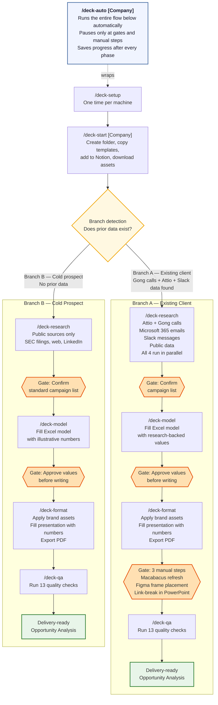

# opportunity-analysis

The Jolly Opportunity Analysis plugin for Claude. Give it a company name and it handles the research, builds the financial model, and formats the presentation — start to finish.

> **Internal tool.** Requires access to the private `nishant-jolly/opportunity-analysis` repo and the Jolly shared workspace.

**Two ways to use it:** run the whole workflow automatically with `/deck-auto [Company]`, or run each step yourself one at a time. Both are covered below.

---

## Workflow at a glance

```
┌─────────────────────────────────────────────────────────────────────────────────────┐
│                      JOLLY OPPORTUNITY ANALYSIS PIPELINE                            │
├────────────────┬───────────────────────────────────────────┬────────────────────────┤
│   Command      │  What it does                             │  Output                │
├────────────────┼───────────────────────────────────────────┼────────────────────────┤
│ /deck-auto     │  Runs the whole workflow automatically,   │  Completed Opportunity │
│  [Company]     │  pausing only when it needs your input.   │  Analysis package      │
│                │  Saves progress so you can stop and       │  ready to send         │
│                │  resume any time.                         │                        │
├────────────────┼───────────────────────────────────────────┼────────────────────────┤
│ /deck-setup    │  First-time setup. Finds your Jolly       │  Saved workspace       │
│   (once)       │  folder and saves its location so all     │  config file           │
│                │  other commands know where to look.       │                        │
├────────────────┼───────────────────────────────────────────┼────────────────────────┤
│ /deck-start    │  Creates the client folder, copies the    │  Templates in place,   │
│  [Company]     │  right template files, opens them,        │  company added to      │
│                │  adds the company to Notion, and starts   │  Notion pipeline,      │
│                │  downloading logos and brand assets       │  assets downloading    │
│                │  in the background.                       │  in background         │
├────────────────┼───────────────────────────────────────────┼────────────────────────┤
│ /deck-research │  Pulls everything Claude can find about   │  Research summary,     │
│                │  the company — CRM records, emails,       │  campaign list for     │
│                │  Slack messages, public data. Proposes    │  your approval         │
│                │  a campaign list for your approval.       │                        │
├────────────────┼───────────────────────────────────────────┼────────────────────────┤
│ /deck-model    │  Fills in the Excel model with the        │  Populated Excel model │
│                │  research data. Shows you the full plan   │  with source notes     │
│                │  first — you approve before it writes     │  on every cell         │
│                │  anything.                                │                        │
├────────────────┼───────────────────────────────────────────┼────────────────────────┤
│ /deck-format   │  Pulls in brand assets, fills in the      │  Formatted PowerPoint, │
│                │  presentation with the right numbers,     │  exported PDF          │
│                │  walks you through manual brand steps,    │                        │
│                │  exports PDF.                             │                        │
├────────────────┼───────────────────────────────────────────┼────────────────────────┤
│ /deck-qa       │  Runs a full quality check across the     │  QA report,            │
│                │  model and presentation before delivery.  │  delivery-ready files  │
│                │  Flags anything that needs fixing.        │                        │
└────────────────┴───────────────────────────────────────────┴────────────────────────┘

Total time: ~30–45 minutes per Opportunity Analysis.
```

---

## Two ways to work

### Automatic mode — `/deck-auto [Company]`

This is the recommended way to run the workflow. Type `/deck-auto Firebirds` (or whatever company name), and Claude takes it from there.

Claude will run every phase in order — research, model, formatting, QA. Along the way it will pause and ask you questions, like which template to use or whether the campaign list looks right. There are also three steps only you can do (like manually refreshing a link in PowerPoint) — Claude will stop, give you clear instructions, wait for you to finish, and then continue.

When it stops, it saves your progress automatically. Think of this like a bookmark — if you need to close your laptop and come back later, just run `/deck-auto [Company]` again and it picks up exactly where it left off. You do not lose any work.

### Step-by-step mode

Run each command yourself in order: `/deck-start`, then `/deck-research`, then `/deck-model`, then `/deck-format`, then `/deck-qa`. This gives you more control and lets you review each phase before moving to the next. The rest of this guide covers each command in detail.

---

## How the workflow flows



The diagram shows how an Opportunity Analysis moves from setup through research, modeling, formatting, and QA — with two paths depending on whether the company is an existing client or a brand-new prospect. The orange diamond shapes are gates where the workflow pauses and waits for your input before continuing. `/deck-auto` is a wrapper that drives through the entire flow for you, so you only have to respond at those gate points rather than kick off each step manually.

---

## Install

Open Claude Code (the chat interface you use for Claude) and type:

```
/plugin install nishant-jolly/opportunity-analysis --scope user
```

You need access to the private Jolly GitHub repo for this to work. If you get an error, ask the ops team.

---

## First-time setup

You only need to do this once, on each computer you use.

### Step 1 — Tell Claude where your Jolly folder is

Claude needs to know where the Jolly shared folder lives on your computer. This is called your "workspace path" — it is just the folder location.

Ask the ops team to set this up for you when you first install the plugin. They will point Claude to the right folder (something like `Jolly - Documents` in your OneDrive).

If you are already set up and want to check, the path looks like:

```
/c/Users/YourName/OneDrive - Default Directory/Jolly - Documents
```

Not sure where your Jolly folder is? Ask the ops team.

### Step 2 — Run setup

Once the folder path is configured, type this in Claude:

```
/deck-setup
```

Claude will find your client folder, confirm the location, and save it so all future commands know where to look. This takes a few seconds and you only do it once. If you run it again later, it will just confirm everything is already set up and stop.

---

## Commands reference

### `/deck-setup`

**What it does:** Finds your Jolly client folder and saves its location. All other commands depend on this running first.

**What you do:** Nothing — just run it.

**What Claude does:** Scans your workspace for the client folder. If it finds more than one possible match, it will ask you to confirm which one to use.

**Output:** A saved config file that all other commands read from automatically.

**Run this:** Once, on first install.

---

### `/deck-start [Company Name]`

**What it does:** Gets everything ready to start a new Opportunity Analysis. Creates the folder structure, copies the right template files, opens them on your screen, adds the company to the Notion pipeline, and starts downloading logos and brand assets in the background while you move on.

**What you do:** Provide the company name. Claude will ask you two questions before starting: which template to use, and which vertical (industry) the company is in.

**What Claude does:**
- Checks whether you already have an active session for this company (and stops if you do, to avoid duplicates)
- Lists available templates grouped by industry — you pick the number
- Copies the Excel model and PowerPoint presentation to the right client folder, named with today's date
- Opens both files on your screen
- Adds the company to the Notion "Opportunity Analysis Deck Pipeline" with a due date 4 days out
- Figures out whether this is an existing client (has prior calls, emails, or CRM records) or a brand-new prospect — this affects how research runs later
- Starts downloading logos, swag images, and branded slide frames in the background

**Output:** Templates in the client folder, company in Notion, assets downloading in the background.

**Example:**
```
/deck-start Firebirds
```

---

### `/deck-research`

**What it does:** Pulls together everything Claude can find about the company from your tools — CRM records, past emails, Slack conversations, and public information. Then it proposes a list of campaigns to include in the Opportunity Analysis and asks you to confirm before moving on.

**What you do:** Review the proposed campaign list and type "confirm" to proceed. If anything looks off — a campaign is missing, or one shouldn't be included — say so before confirming.

**What Claude does:** Runs four research tasks at the same time (so it is faster than doing them one by one):

- **CRM and call research** — checks Attio for records, notes, and emails; pulls transcripts from past calls if this is an existing client
- **Email and file research** — searches Outlook and SharePoint for relevant emails and documents
- **Slack research** — searches Slack for messages about the company
- **Public research** — looks up SEC filings (for public companies), industry benchmarks, LinkedIn headcount, and other public sources

All four run in parallel and report back with their findings. Claude then combines everything, flags any conflicts between sources, and presents a clean summary. If any required information is missing, it will tell you before asking for campaign confirmation.

**Output:** A research summary file saved to your workspace, and a confirmed campaign list that flows into the next step.

**Gate:** Claude will pause and ask you to confirm the campaign list before continuing.

---

### `/deck-model`

**What it does:** Fills in the Excel financial model using the research data. Before writing anything, it shows you the full plan — every value it intends to enter, with the source — and waits for your approval.

**What you do:** Review the plan Claude presents. If everything looks right, type "approve." If something needs to change, tell Claude what to adjust before approving.

**What Claude does:**
- Maps every value to the right cell in the model by looking up row labels (not fixed positions, so it works across all template versions)
- Rounds every number to Jolly's standards (e.g., revenue to the nearest $500K, employees to the nearest 50)
- Checks that every campaign's return-on-spend falls in the 10x–30x target range
- Checks that total EBITDA impact stays within the 15% ceiling
- After approval, writes every value and adds a source note to each hard-coded cell explaining where the number came from
- Verifies no formula cells were accidentally overwritten

**Output:** A fully populated Excel model with source notes on every assumption cell.

**Gate:** Claude will pause and show you the full plan before writing anything. You must type "approve" to continue.

---

### `/deck-format`

**What it does:** Takes the branded assets and model outputs and puts them into the PowerPoint presentation. Walks you through any manual steps one at a time. Exports the final PDF when done.

**What you do:** There are a few manual steps only you can do in PowerPoint (like refreshing a data link). Claude will stop at each one, give you clear step-by-step instructions, and wait for you to type "done" before moving on.

**What Claude does:**
- Exports company-branded slide frames from Figma (the design tool where slide templates live)
- Scans every slide for placeholder text (like `[Company Name]` or `[Revenue]`) and replaces them with the correct values
- Formats all dollar amounts correctly — under $1M shows as `$516K`, $1M and above shows as `$1.96MM`
- Presents the replacement plan for each section and waits for your approval before writing
- Walks through placing logos, swag images, and banner graphics
- Exports the final PDF to the Reports folder and opens it for your review

**Output:** A formatted PowerPoint file and an exported PDF in the `4. Reports` folder.

**Gates:** Claude will pause for approval before replacing banner values, before replacing text values, and at each manual step.

---

### `/deck-qa`

**What it does:** Runs a full quality check on the model and presentation before you send anything. Catches formatting issues, missing data, out-of-range numbers, and anything else that would be embarrassing to send to a client.

**What you do:** Review any flagged issues and fix them. Claude walks through each one interactively and re-runs the check after you confirm it is fixed.

**What Claude does:** Runs 13 named checks:

| Check | What it looks for |
|-------|-------------------|
| M1 | Correct number of formula cells in the model (confirms nothing was accidentally deleted or overwritten) |
| M2 | No required assumption cells left blank |
| M3 | Every active campaign's return-on-spend is in the 10x–30x range |
| M4 | Total EBITDA impact is within the 15% ceiling |
| M5 | Hiring cost is not above $3,500 (QSR models) |
| M6 | Source notes present on all hard-coded cells |
| D1 | No placeholder text remaining in the presentation (e.g., `[Company Name]`) |
| D2 | All dollar amounts formatted correctly |
| D3 | Banner numbers on the presentation match the model output |
| D4 | Campaign slides match the approved campaign list |
| D5 | Logo and brand assets are placed |
| D6 | Return-on-spend values are hidden on prospect presentations (not shown to new clients) |
| D7 | The exported PDF matches the current state of the presentation |

After all checks pass, Claude cleans up any temporary lock files and gives you the final list of delivery-ready files.

**Gate:** Claude will not mark the Opportunity Analysis as complete until all failing checks are resolved.

---

## How it works

When you run `/deck-research`, Claude sends out four separate research tasks at the same time — one to check your CRM, one to check emails and files, one to check Slack, and one to look up public information. Each task runs on its own and reports back with its findings. Claude then combines everything into one summary, flags any conflicts between sources, and asks you to confirm the campaign list before moving on.

Progress is saved after every phase. That saved progress file (think of it as a bookmark) lives in the `.claude/data/` folder in your workspace. If a session gets interrupted — you close Claude, your laptop dies, anything — just run the same command again and Claude reads the bookmark and picks up where it left off. Nothing is lost.

---

## Requirements

### Connect these in Claude settings first

Go to Claude.ai Settings > Integrations and make sure these are all connected before you start:

| Tool | What it is used for |
|------|---------------------|
| Slack | Searching messages and channels |
| Attio | CRM records, contact notes, email history |
| Linear | Issue tracking |
| Notion | Adding companies to the pipeline database |
| Microsoft 365 | Searching Outlook emails and SharePoint files |

If any of these are not connected, Claude will not be able to pull data from that source and will tell you what is missing.

### For the ops team

<details>
<summary>Python packages (technical setup — AEs do not need this)</summary>

```bash
pip install openpyxl python-pptx requests edgartools
```

Also install the superpowers plugin in Claude Code:
```
/plugin install superpowers@mbenhamd --scope user
```

Set `JOLLY_WORKSPACE` as a system environment variable (not just in `.env`) so it is available when Claude Code launches. On Windows, set it via System Properties > Environment Variables.

</details>

---

## Updating the plugin

When a new version is available, run:

```
/plugin update opportunity-analysis
```

---

## Troubleshooting

**"Claude says workspace not configured"**
Run `/deck-setup` first. This is the one-time setup that tells Claude where your Jolly folder is. You need to do it before any other command will work.

**"Claude says a session already exists for this company"**
This means you already started an Opportunity Analysis for this company. You have two options: continue from where you left off by running `/deck-auto [Company]` (or the next step command), or delete the session file if you want to start over from scratch. To start over, ask the ops team to delete the session state file for that company.

**"I closed Claude and lost my progress"**
You did not lose anything. Run `/deck-auto [Company]` again (or the specific step command you were on) and Claude will read the saved bookmark and resume from where it stopped.

**"The logos or swag images are missing"**
The asset download runs in the background during `/deck-start`. It sometimes finishes after you have already moved on. Check the `3. Company Resources/Logos` and `3. Company Resources/Swag` folders — the files may already be there. If not, ask the ops team to run the asset gatherer manually.

**"A manual step in `/deck-format` is confusing"**
Each manual step comes with detailed instructions in the chat. Read them carefully, complete the step in PowerPoint, then come back to Claude and type "done" to continue.

**"A command is taking a long time"**
The research step pulls from multiple sources at once and can take 2–5 minutes depending on how much data exists. The model step can also take a minute or two if there are many campaigns. If it has been more than 10 minutes with no response, something may have gone wrong — ask the ops team.

---

## For the team

**Run commands from anywhere in your Jolly workspace.** Claude resolves all file paths from the saved workspace config, so you do not need to be in any specific folder.

**New computer or new team member?** Ask the ops team to configure your workspace path when you first install. Do not skip this — nothing else will work without it.

**Existing client vs. new prospect matters.** Claude detects this automatically during `/deck-start` by checking whether any prior calls, emails, or CRM records exist for the company. Existing clients (Branch A) get a research-backed Opportunity Analysis using all internal data. New prospects (Branch B) get an illustrative Opportunity Analysis using public data only. Claude will tell you which branch it detected.

**If something seems wrong mid-workflow,** the session state file (your progress bookmark) in `.claude/data/` shows exactly what phase last completed and what Claude was about to do next. This is the first place to check. Ask the ops team if you need help reading it.
